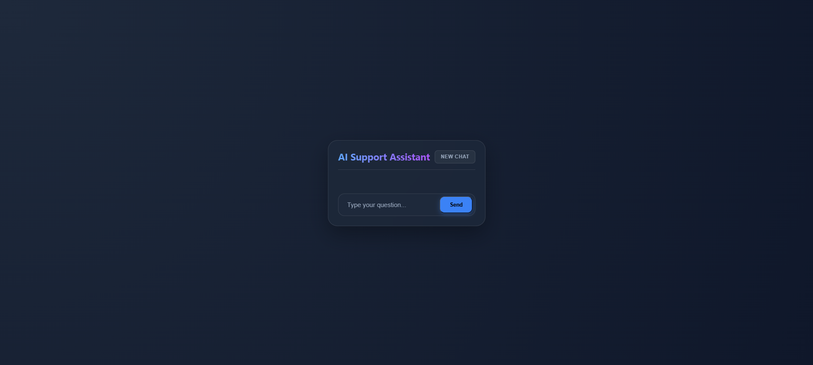
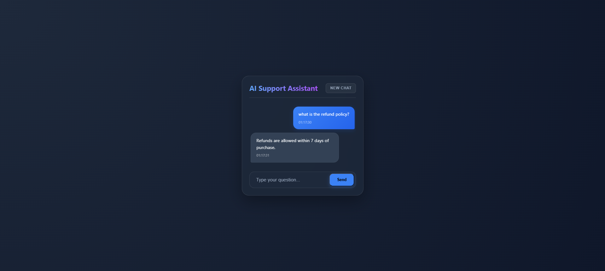
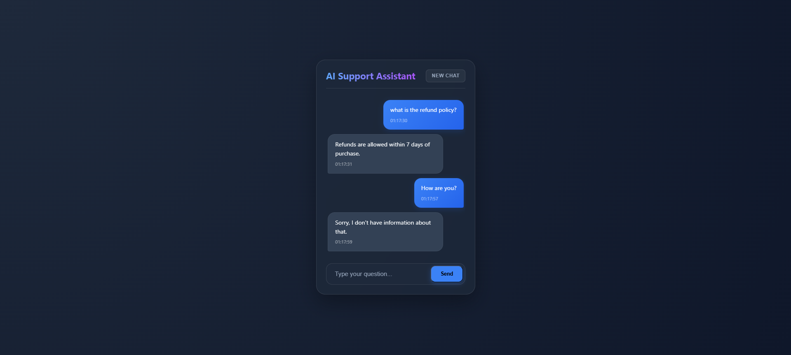
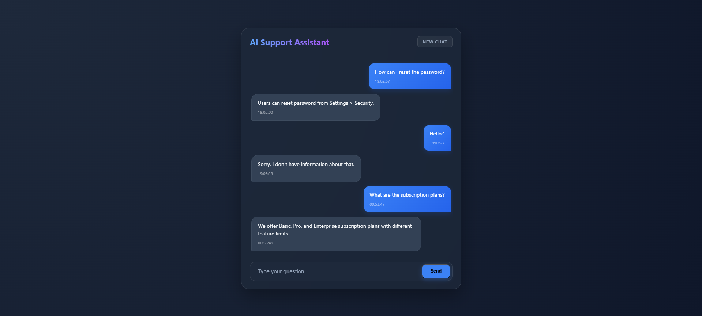
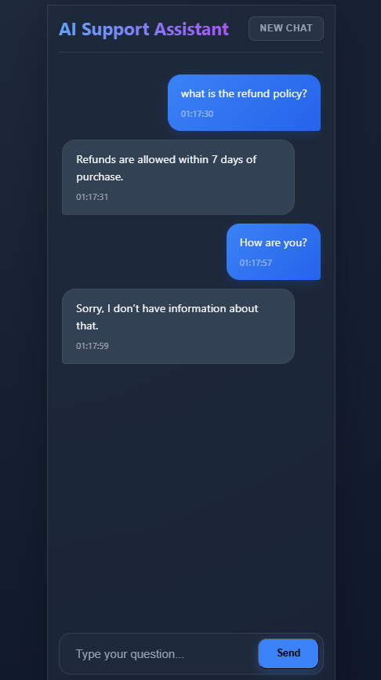

# AI Powered Support Assistant

A full-stack AI-powered support chat application built with React (Vite), Node.js (Express), SQLite, and Google Gemini LLM. The assistant answers user queries strictly based on the provided document (docs.json),maintains session-level memory, and persists all conversations in SQLite.

The Assistant will never hallucinate
If the is not found in the documentation, it responds with:
"Sorry, I dont have information about that."

## Live Demo

### Frontend : [https://ai-powered-support-assistant-three.vercel.app/] (https://ai-powered-support-assistant-three.vercel.app/)

### Backend API : [https://ai-powered-support-assistant-v5th.onrender.com] (https://ai-powered-support-assistant-v5th.onrender.com)

## Sample UI Screenshots

### Initial Chat Interface


### Strict Document-Based Response 


### Strict Not in Document-Based Response


### Session Memory Persistence


### Mobile Responsiveness


## System Architecture

```
User (Browser)
        |
React Frontend (Vite)
        |
Express Backend API
        |
SQLite Database (Sessions + Messages)
        |
Gemini LLM (Document-Based Answering)
```

### Architecture Highlights

- **Stateless REST API:** Clean separation of concerns for React and Express.
- **RAG Implementation:** Grounding AI responses in local `docs.json` data to eliminate hallucinations.
- **Persistent Memory:** SQLite-backed storage for seamless session-based chat history.
- **Security First:** Environment-based secret management and rate limiting to protect API quotas.
- **Robustness:** Centralized error handling and ESM-standard module resolution.

## Tech Stack
- **Frontend:** React.js (Vite), LocalStorage session handling
- **Backend:** Node.js (Express), SQLite (persistent storage), express-rate-limit, dotenv, Gemini LLM SDK
- **Database:** SQLite
- **LLM:** Google Gemini (gemini-2.5-flash)

## Project Structure
- `/frontend`: React application (UI, Chat Interface, Session Management)
- `/backend`: Express API (LLM Orchestration, SQLite Integration, Rate Limiting)


## Core Features

- **Strict Document-Based QA:** Answers only using `docs.json`
- **Session Memory:** Remembers the last 5 message pairs using SQLite.
- **Persistent Chat:** Sessions are stored in the LocalStorage and synced with the Database.
- **REST APIS:** Clean REST API Design.
- **Error Handling:** Centralized Error Handling.
- **Rate Limiting:** Basic IP-based protection for the API.
- **Environment Variables:** Environemt based configuration

## Security & Reliability

- **Secret Management:** API keys stored in `.env` with `.gitignore` protection.
- **Resilient Startup:** Fail-fast mechanism if critical environment variables (e.g., `GEMINI_API_KEY`) are missing.
- **Traffic Control:** Rate limiting implemented to prevent abuse and protect API quotas.
- **AI Grounding:** Strict context injection to prevent hallucinations and enforce factual accuracy.
- **Clean Architecture:** Centralized error-handling middleware and robust input validation for all API endpoints.

## Database Schema

### Table: `sessions`
|   column        |     type        |       notes                   |
|-----------------|-----------------|-------------------------------|
|   id            |     TEXT        |   Primary Key (sessionId)     |
|   created_at    |     DATETIME    |   session creation timestamp  |
|   updated_at    |     DATETIME    |   last activity timestamp     |

### Table: `messages`
|   column        |     type        |       notes                   |
|-----------------|-----------------|-------------------------------|
|   id            |     INTEGER     |   Primary Key (autoincrement) |
|   session_id    |     TEXT        |   Foreign Key to sessions     |
|   role          |     TEXT        |   "user" or "assistant"       |
|   content       |     TEXT        |   message text                |
|   created_at    |     DATETIME    |   message timestamp           |

## Document-Based Answering (RAG)

The assistant is grounded in a local knowledge base to ensure accuracy and prevent hallucinations. Instead of relying on general knowledge, it retrieves from `docs.json` before generating a response.

### Knowledge Base Source
**Location:** `backend/data/docs.json`

The system uses a JSON-based repository of product FAQs. Each entry consists of a `title` for categorization and `content` which serves as the source of truth for the AI.

**Example Schema:**
```json
[
  {
    "title": "Reset Password",
    "content": "Users can reset password from Settings > Security.\nFollow the prompts sent to your registered email address."
  },
  {
    "title": "Refund Policy",
    "content": "Refunds are allowed within 7 days of purchase.\nTo initiate a refund, please contact our support team with your order ID."
  }
]
```

## Prompt Construction Logic

The backend utilizes a "Context-Injection" strategy to ground the AI. Before each API call, the `buildPrompt` utility assembles a strict, structured payload to ensure the assistant remains factual and focused.

### The System Prompt Template
The following logic is hard-coded into the generation service to enforce professional boundaries:

> **Strict Rules:**
> 1. Answer **ONLY** using the provided documentation.
> 2. If the answer is not explicitly found, respond **EXACTLY** with:  
>    *"Sorry, I don't have information about that."*
> 3. Do **NOT** make assumptions.
> 4. Do **NOT** add extra information.

### Dynamic Prompt Assembly
The final prompt is a template-literal string composed of three dynamic variables:

|     Component     | Variable         |                Description                          |
|-------------------|------------------|-----------------------------------------------------|
| **Documentation** | `${docs}`        | Relevant FAQ snippets retrieved from `docs.json`.   |
| **Conversation**  | `${history}`     | Previous message pairs to maintain chat continuity. |
| **User Message**  | `${userMessage}` | The raw input from the customer.                    |

# API Documentation

## 1. Chat Endpoint

### `POST /api/chat`

### Request:

```json
{
  "sessionId": "abc123",
  "message": "How can I reset my password?"
}
```

### Response:

```json
{
  "reply": "Users can reset password from Settings > Security.",
  "tokensUsed": 123
}
```

### Errors:

```json
{
  "error": "SessionId and message are required."
}
```

## 2. Fetch Conversation

### `GET /api/conversations/:sessionId`

Returns full conversation in chronological order.

### Response:

```json
[
  {
    "role": "user",
    "content": "How can I reset my password?",
    "created_at": "2026-02-24T10:00:00Z"
  },
  {
    "role": "assistant",
    "content": "Users can reset password from Settings > Security.",
    "created_at": "2026-02-24T10:00:02Z"
  }
]
```

## 3. List Sessions

### `GET /api/sessions`

### Response:

```json
[
  {
    "sessionId": "abc123",
    "lastUpdated": "2026-02-24T10:00:02Z"
  }
]
```

## Testing & Verification

To ensure the assistant adheres to the defined strict behavior and RAG logic, the following test cases are used to verify performance:

### 1. Factual Recall (Grounded Answering)
* **Query:** "How do I reset password?"
* **Expected Result:** The assistant retrieves the "Reset Password" entry from `docs.json` and provides the correct instructions.
* **Verification:** Confirms the RAG retrieval and injection logic is working.

### 2. Hallucination Prevention (Strict Enforcement)
* **Query:** "How are you?"
* **Expected Result:** *"Sorry, I don’t have information about that."*
* **Verification:** Confirms the system strictly follows the instruction to **NOT** make assumptions or use general knowledge outside of the provided documentation.

### 3. Session Persistence
* **Action:** Refresh the browser page during an active conversation.
* **Expected Result:** Previous messages are reloaded from the **SQLite** database via the `sessionId`.
* **Verification:** Confirms the `useEffect` hook and backend conversation history endpoints are integrated correctly.

### 4. Session Reset
* **Action:** Click the "New Chat" button.
* **Expected Result:** A new `sessionId` is generated, and the chat interface is cleared.
* **Verification:** Confirms the `createNewSession` utility and session management logic are functioning as intended.

# Setup Instructions

## Prerequisites

### Make sure you have installed:

- **Node.js** (v18 or higher)
- **npm** (comes with Node)
- **Git**

### Check versions:

```bash
node -v
npm -v
git --version
```

## Clone the Repository
```bash
git clone https://github.com/MMALLIKARJUN2312/AI_Powered_Support_Assistant.git
cd AI_Powered_Support_Assistant
```

## Backend Setup (Node.js + Express + SQLite)

### Navigate to Backend

```bash
cd backend
```

### Install Dependencies

```bash
npm install
```

### Configure Environment Variables

- **Copy .env.example to .env:**

```bash
cp .env.example .env
```

- **Edit .env and add your LLM API_KEY:**

```env
PORT=5000
GEMINI_API_KEY=your_gemini_api_key_here
```

### Database Setup

- SQLite database file (database.sqlite) is created automatically.
- sessions and messages will be created automatically.
- No manual setup is required.

### Start Backend Server

### Development Mode:

```bash
npm run dev
```

### Production Mode:

```bash
npm start   
```

Backend runs at: [http://localhost:5000](http://localhost:5000)

## Frontend Setup (React.js)

### Navigate to Frontend

```bash
cd frontend
```

### Install Dependencies

```bash
npm install
```

### Configure API Base URL (if backend port differs)

**Edit frontend/src/api.js** 

- export const API_BASE_URL = "http://localhost:5000"

### Start React App

### Development Mode:

```bash
npm run dev
```

### Production Mode:

```bash
npm run build
npm run preview   
```

Frontend runs at: [http://localhost:5173](http://localhost:5173)
